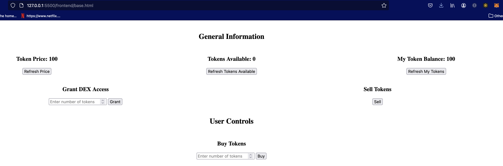
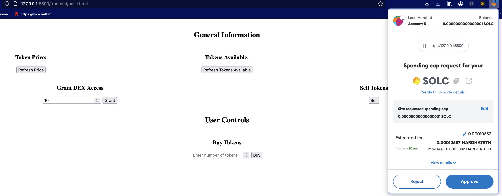
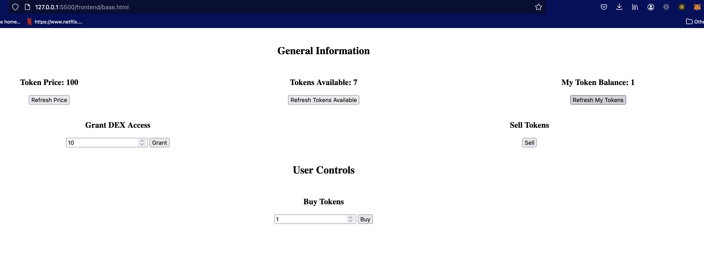
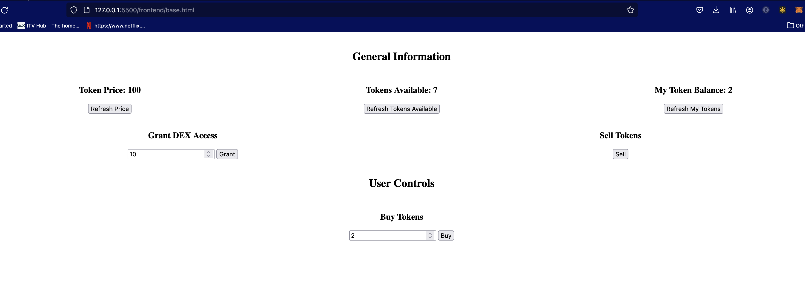
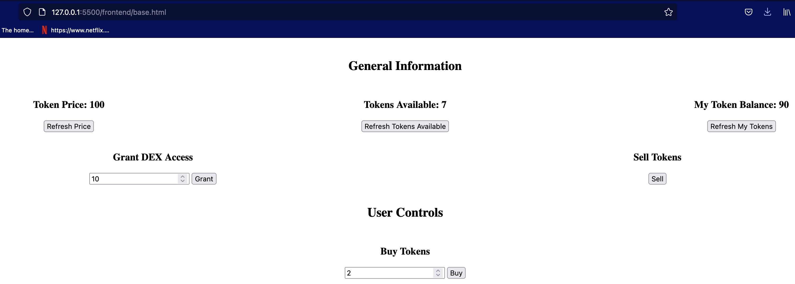

# Simple ERC20 Token Decentralised Exchange (DEX) Project in Ethereum Solidity

This project demonstrates a basic decentralised exchange (DEX) use case that allows a token creator/supplier to authorize a DEX for trading tokens with two other accounts/parties interacting with the exchange. The token creator transfers tokens to the exchange from their available tokens and the dex makes the token available for trading. Other accounts interact with the dex to trade (buy and sell) the tokens.

The project comes with 2 simple contracts (1 token contract and 1 dex contract), a unit tests suite covering each the contracts, a simple web-based graphical user interface, and Hardhat configurations used to deploy both the token and dex contracts.

Sample GUI showing interactions between the market participants and the decentralised exchange.

## Installation & Deployment

### Installation

Inside project directory, do:

```shell
npm init (choose defaults)
npm install --save-dev hardhat  (choose defaults)
npx hardhat init (choose defaults)
npm i @openzeppelin/contracts (choose defaults)
```

### Deployment

### Trading (Use case demo)

#### Initial tokens supplies



#### Token DEX authorisation (for trading)



#### User Buys 1 token:



#### User Buys 2 tokens



#### Token Balance in supplier account


